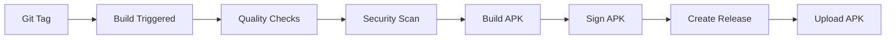

# CI/CD Pipeline Documentation

## Overview

This project implements a comprehensive CI/CD pipeline using GitHub Actions with containerized builds, automated testing, security scanning, and release management.

## Pipeline Features

### 🚀 Automated Builds
- **Multi-stage builds**: Debug and Release APKs
- **Containerized builds**: Docker-based Android SDK environment
- **Parallel execution**: Optimized build times with caching
- **Dynamic versioning**: Git-based version management

### 🧪 Quality Assurance
- **Unit tests**: Comprehensive test coverage with JaCoCo reports
- **Integration tests**: Android emulator-based testing
- **Code quality**: ktlint, detekt, and Android lint checks
- **Security scanning**: CodeQL and dependency vulnerability checks

### 📦 Release Management
- **Automated releases**: Tag-based release creation
- **Signed APKs**: Release builds with proper signing
- **Artifact management**: Organized build artifacts
- **Release notes**: Automated changelog generation

## Workflow Structure

### Main CI/CD Pipeline (`main-ci-cd.yml`)

```yaml
Trigger Events:
├── Push to main/develop branches
├── Pull requests to main/develop
├── Git tags (v*)
└── Manual workflow dispatch

Jobs:
├── quality-checks (Tests, Lint, Security)
├── security-scan (CodeQL, Dependency Check)
├── build (Debug & Release APKs)
├── release (GitHub Release Creation)
└── containerized-build (Docker-based builds)
```

### Pull Request Checks (`pr-checks.yml`)

```yaml
Focus: Code Quality
├── ktlint formatting checks
├── detekt static analysis
├── Android lint validation
└── PR comment integration
```

## Build Configuration

### Versioning Strategy

The app uses dynamic versioning based on Git:

```kotlin
// Version Code: Git commit count
versionCode = git rev-list --count HEAD

// Version Name: Git tag or fallback
versionName = git describe --tags --abbrev=0 || "1.0.0"

// Build Info: Timestamp, hash, branch
buildConfigField "String", "BUILD_TIME", currentTimestamp
buildConfigField "String", "GIT_HASH", gitHash
buildConfigField "String", "GIT_BRANCH", gitBranch
```

### Build Types

| Type | Minify | Signing | Debug Info | Purpose |
|------|--------|---------|------------|---------|
| **Debug** | ❌ | ❌ | ✅ | Development & Testing |
| **Release** | ✅ | ✅ | ❌ | Production Distribution |

### Security Features

- **Code obfuscation**: ProGuard/R8 optimization
- **Resource shrinking**: Unused code removal
- **Certificate pinning**: Network security
- **Encryption**: SQLCipher database encryption
- **Biometric auth**: Secure access control

## Containerized Builds

### Docker Setup

```dockerfile
# Multi-stage build
FROM openjdk:17-jdk-slim as base
├── Android SDK installation
├── Build tools setup
└── Environment configuration

FROM base as builder
├── Source code copying
├── Gradle build execution
└── APK generation

FROM alpine:latest as final
└── APK distribution
```

### Docker Compose

```yaml
Services:
├── android-builder: Main build process
├── android-test: Test execution
└── android-lint: Code quality checks
```

## Testing Strategy

### Test Coverage

```bash
# Unit Tests
./gradlew testDebugUnitTest

# Integration Tests
./gradlew connectedDebugAndroidTest

# Coverage Reports
./gradlew jacocoTestReport
```

### Test Types

| Type | Scope | Framework | Coverage |
|------|-------|-----------|----------|
| **Unit Tests** | Business Logic | JUnit + Mockito | 100% Target |
| **Integration Tests** | Database & Services | Room + Hilt | Critical Paths |
| **UI Tests** | Compose Screens | Compose Testing | User Flows |
| **Security Tests** | Encryption & Auth | Custom | Security Features |

## Security Scanning

### CodeQL Analysis

- **Language**: Kotlin
- **Queries**: Security and quality focused
- **Frequency**: Every push and PR
- **Reports**: GitHub Security tab integration

### Dependency Scanning

- **Tool**: OWASP Dependency Check
- **Scope**: All dependencies
- **Format**: HTML, JSON, XML
- **Action**: Block on high/critical vulnerabilities

## Release Process

### Automated Release Flow



### Release Artifacts

- **Signed APK**: Production-ready installation file
- **Release Notes**: Automated changelog generation
- **Build Info**: Version, hash, timestamp details
- **Security Report**: Vulnerability assessment

## Local Development

### Prerequisites

```bash
# Required tools
- Docker & Docker Compose
- Git
- Java 17+
- Android Studio (optional)
```

### Quick Start

```bash
# Clone repository
git clone <repository-url>
cd clipboard-history

# Build with Docker
docker-compose up android-builder

# Run tests
docker-compose up android-test

# Code quality checks
docker-compose up android-lint
```

### Manual Build

```bash
# Setup Android SDK (if available)
export ANDROID_HOME=/path/to/android-sdk
export ANDROID_SDK_ROOT=$ANDROID_HOME

# Build
./gradlew assembleDebug

# Test
./gradlew testDebugUnitTest

# Coverage
./gradlew jacocoTestReport
```

## Monitoring & Maintenance

### Build Monitoring

- **GitHub Actions**: Build status and logs
- **Artifacts**: Downloadable build outputs
- **Security**: Vulnerability alerts
- **Performance**: Build time tracking

### Maintenance Tasks

```bash
# Dependency updates
./gradlew dependencyUpdates

# Security audit
./gradlew dependencyCheckAnalyze

# Code quality
./gradlew ktlintCheck detekt lint
```

## Troubleshooting

### Common Issues

| Issue | Cause | Solution |
|-------|-------|----------|
| **SDK not found** | Missing ANDROID_HOME | Set environment variable |
| **Build timeout** | Resource constraints | Increase runner resources |
| **Test failures** | Flaky tests | Retry mechanism |
| **Signing errors** | Keystore issues | Verify keystore configuration |

### Debug Commands

```bash
# Verbose build
./gradlew assembleDebug --info

# Test with logs
./gradlew testDebugUnitTest --info

# Dependency tree
./gradlew app:dependencies

# Build scan
./gradlew build --scan
```

## Performance Optimization

### Caching Strategy

- **Gradle**: ~/.gradle/caches
- **Android SDK**: Platform and build tools
- **Dependencies**: Maven repository cache
- **Build artifacts**: Incremental builds

### Build Optimization

- **Parallel execution**: Multi-threaded builds
- **Incremental compilation**: Changed files only
- **Resource optimization**: Shrinking and obfuscation
- **Container reuse**: Docker layer caching

## Future Enhancements

### Planned Features

- [ ] **Multi-architecture builds**: ARM64, x86_64 support
- [ ] **Automated testing**: UI automation with Appium
- [ ] **Performance testing**: Memory and CPU profiling
- [ ] **Beta distribution**: Firebase App Distribution
- [ ] **Crash reporting**: Automated crash analysis
- [ ] **A/B testing**: Feature flag management

### Integration Opportunities

- [ ] **Slack notifications**: Build status updates
- [ ] **Jira integration**: Issue tracking
- [ ] **SonarQube**: Code quality metrics
- [ ] **Artifactory**: Artifact management
- [ ] **Kubernetes**: Scalable build infrastructure

---

For more information, see the [main README](README.md) or [API documentation](docs/API.md).